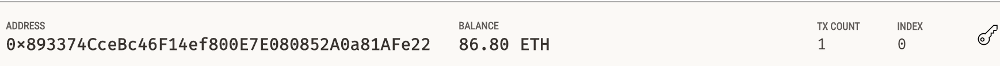

[Technologies](#Technologies) | [Installation](#installation-guide) | [Usage](#usage) | [Screenshots](#screenshots) | [Contributors](#contributors) | [License](#license)

# fintech_finder
This is a blockchain-based workforce hiring and payment system, using Streamlit for a user-friendly web interface. The App enables customers to instantly pay the fintech professionals whom they hire with cryptocurrency, by integrating the Ethereum blockchain network into the application. We use Python libraries/modules along with Streamlit and Ganache test blockchain provider for demonstrating the results shown below sections.

## Technologies

This project leverages python 3.7 with the following packages / IDEs:

* [python](https://wiki.python.org/moin/FrontPage) - is an object-oriented, interpreted, and interactive programming language.

* [streamlit](https://streamlit.io/) - Streamlit is an open-source app framework for Machine Learning and Data Science teams.

* [Visual Studio Code](https://code.visualstudio.com/?wt.mc_id=DX_841432) - Visual Studio Code is a lightweight but powerful source code editor which runs on your desktop and is available for Windows, macOS and Linux. 

* [Ganache](https://trufflesuite.com/ganache/) - A program that allows you to quickly set up a local blockchain, which you can use to test and develop smart contracts. 

* [BIP44](https://github.com/bitcoin/bips/blob/master/bip-0044.mediawiki) - A Python implementation for deriving hierarchical deterministic wallets from a seed phrase based on the BIP-44 standard. 

* [web3.py](https://web3py.readthedocs.io/en/stable/quickstart.html) - A Python library for connecting to and performing operations on Ethereum-based blockchains. Web3.py can help you read block data, sign and send transactions, deploy and interact with contracts, and a number of other features.

* [mnemonic](https://pypi.org/project/mnemonic/) - A Python implementation for generating a 12- or 24-word mnemonic seed phrase based on the BIP-39 standard.

---

## Installation Guide

You will need Python version 3.7 or above and gitbash/terminal on your computer, along with other supporting packages as mentioned below. 

Please follow instructions from the below link to install python 3.7 or above on your computer

[To install Python, follow instructions from this link](https://www.python.org/downloads/)

[To install Git Bash, follow instructions from this link](https://github.com/git-guides/install-git)

[To install Anaconda, follow instructions from this link ](https://docs.anaconda.com/anaconda/install/)

[To install Streamlit, follow instructions from this link ](https://docs.streamlit.io/library/get-started/installation)

[To install Visual Studio Code, follow instructions from this link ](https://code.visualstudio.com/docs/setup/setup-overview)

[To install Ganache, follow instructions from this link to download and install ](https://trufflesuite.com/ganache/)

[To install Microsoft Visual C++ Build Tools in Windows(dependency for Web3.py in windows), follow instructions below](https://visualstudio.microsoft.com/downloads/)

    * [Go to](https://visualstudio.microsoft.com/downloads/)
    * Scroll down the page, and then click "Tools for Visual Studio 2019" to reveal the options.
    * Download the "Build Tools for Visual Studio 2019" package.
    * Run the package file and select the C++ Build Tools option. Then click Install. The installation process takes about 15 minutes.


```python
# install conda dev environment and activate it
    conda update conda
    conda create -n dev python=3.7 anaconda
    conda activate dev

# install Jupyter Lab (Optional)
    pip install jupyterlab
  
# Install Streamlit 
    conda activate dev
    pip install streamlit 

# Install Web3.py library
    conda activate dev
    pip install web3==5.17

# Install ethereum-tester library (Optional)
    conda activate dev
    pip install eth-tester==0.5.0b3

# Install mnemonic package 
    conda activate dev
    pip install mnemonic

# Install bip44 package
    conda activate dev
    pip install bip44


```

---


## Usage

To use the Fintech Finder App, clone the repository and run the above commands in gitbash as applicable,

```git
git clone https://github.com/sidbetatester/fintech_finder.git

# 1. From your terminal, navigate to the project folder that contains your `.env` file and the `fintech_finder.py` and `crypto_wallet.py` files. Be sure to activate your Conda `dev` environment if it # is not already active.

cd fintech_finder

# 2. To launch the Streamlit application,type

streamlit run fintech_finder.py

# 3. On the resulting webpage, select a candidate that you would like to hire from the appropriate drop-down menu. Then, enter the number of hours that you would like to hire them for. (Remember, you do not have a lot of ether in your account, so you cannot hire them for long!)

# 4 Click the Send Transaction button to sign and send the transaction with your Ethereum account information. If the transaction is successfully communicated to Ganache, validated, and added to a block, a resulting transaction hash code will be written to the Streamlit application sidebar.

```
Note: to close Streamlit from gitbash, click ctrl + 'c'


   
## Screenshots

### fintech_finder app interface:


### Screenshot of the address, balance, and transaction (TX) count from the Ganache accounts tab for account (index 0):



### Screenshot of transaction from the Ganache transaction tab:


## Contributors

Siddharth Venkumahanti
[linkedin](https://www.linkedin.com/in/siddharthvenkumahanti/)


---


## License

### MIT License

Copyright (c) [2022] [Siddharth Venkumahanti]

Permission is hereby granted, free of charge, to any person obtaining a copy
of this software and associated documentation files (the "Software"), to deal
in the Software without restriction, including without limitation the rights
to use, copy, modify, merge, publish, distribute, sublicense, and/or sell
copies of the Software, and to permit persons to whom the Software is
furnished to do so, subject to the following conditions:

The above copyright notice and this permission notice shall be included in all
copies or substantial portions of the Software.

THE SOFTWARE IS PROVIDED "AS IS", WITHOUT WARRANTY OF ANY KIND, EXPRESS OR
IMPLIED, INCLUDING BUT NOT LIMITED TO THE WARRANTIES OF MERCHANTABILITY,
FITNESS FOR A PARTICULAR PURPOSE AND NONINFRINGEMENT. IN NO EVENT SHALL THE
AUTHORS OR COPYRIGHT HOLDERS BE LIABLE FOR ANY CLAIM, DAMAGES OR OTHER
LIABILITY, WHETHER IN AN ACTION OF CONTRACT, TORT OR OTHERWISE, ARISING FROM,
OUT OF OR IN CONNECTION WITH THE SOFTWARE OR THE USE OR OTHER DEALINGS IN THE
SOFTWARE.


